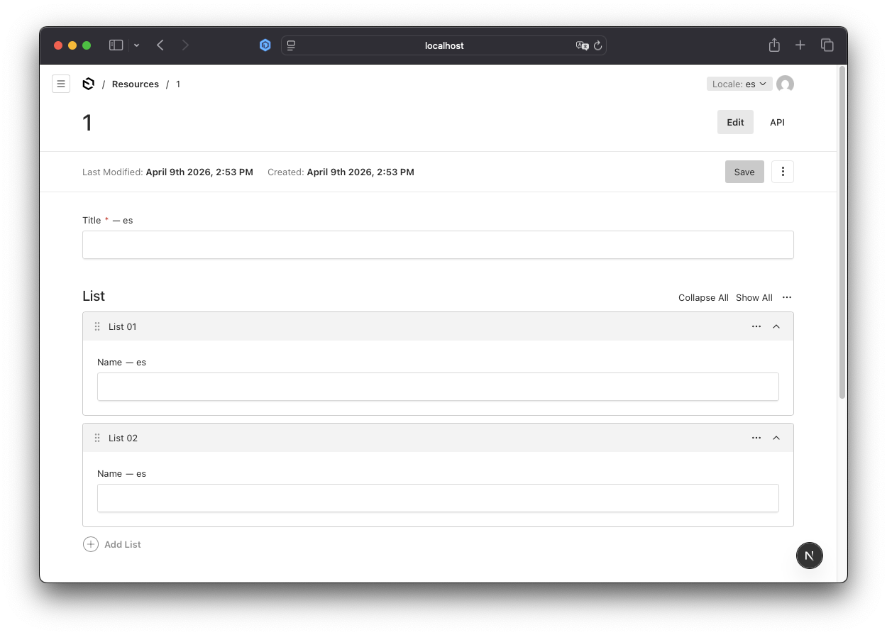
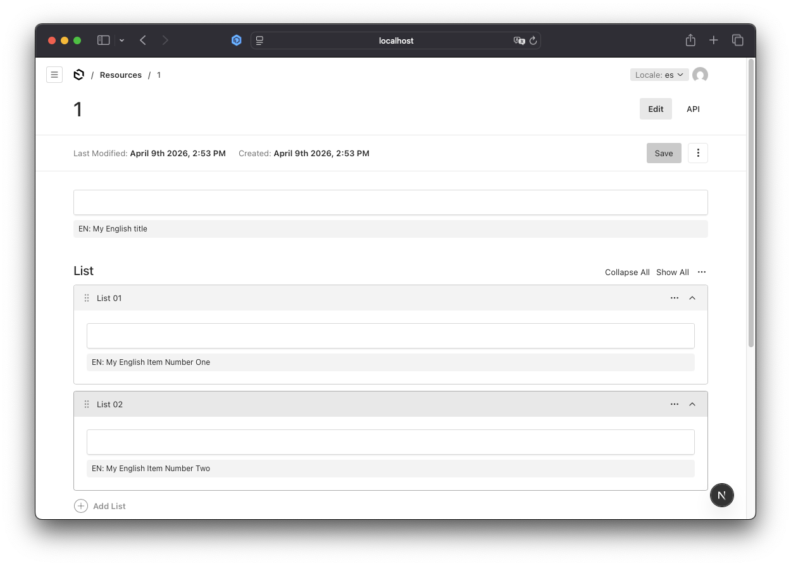
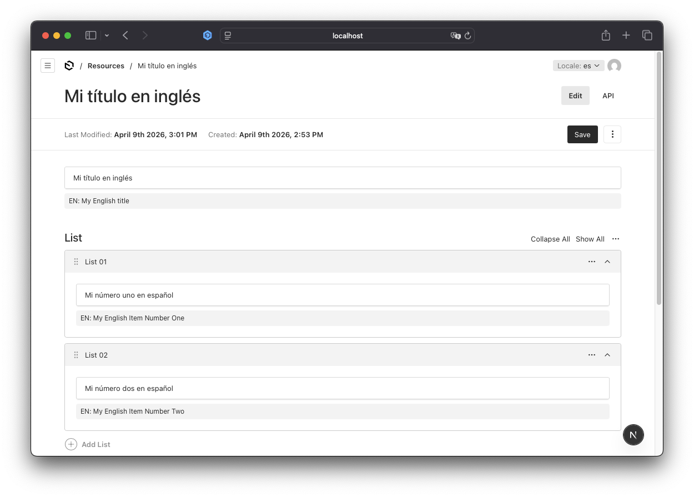

# How to Show Default Locale Hints in Localized Array Fields in Payload CMS

When building multilingual applications with Payload CMS, you'll quickly encounter a frustrating UX issue: localized fields inside arrays appear empty when editors switch to secondary locales.

## Real-World Scenario

Imagine you're building a multilingual product catalog with Payload CMS. Your schema looks like this:

```tsx
{
  name: 'list',
  type: 'array',
  fields: [
    {
      name: 'name',
      type: 'text',
      localized: true,
    },
  ]
}
```

**What happens:**

1. English editor fills in all product names
2. Spanish editor switches locale to Spanish
3. All fields appear completely empty
4. Editor has no context about what needs translation



This creates several problems:

- **Editors waste time** - They can't see what content exists in the default locale
- **Translation errors** - No context leads to inconsistent translations
- **Workflow bottlenecks** - Constant back-and-forth between locales
- **Poor UX** - Frustrating editing experience

## Why This Happens

This is not a bug in Payload CMS - it's by design. Understanding why helps you implement the correct solution.

### How Payload Stores Localized Data

Payload CMS handles localization at the field level, not the document level. When you mark a field as `localized: true`:

```tsx
{
  name: 'title',
  type: 'text',
  localized: true,
}
```

Payload stores it like this in the database:

```json
{
  "title": {
    "en": "English Title",
    "es": "Título en Español"
  }
}
```

### The Admin UI Only Shows Current Locale

The admin interface only renders the value for the active locale. If `es` is empty, you see an empty field - even though `en` has data.

### Arrays Are Shared Across Locales

Arrays themselves are not localized - only the fields inside them:

```json
{
  "list": [
    {
      "id": "1",
      "name": {
        "en": "Item One",
        "es": ""
      }
    }
  ]
}
```

The array structure is shared, but field values are locale-specific.

### Fallback Only Works in the API

Payload's `fallback: true` config ensures empty locale values return the default locale via the API:

```tsx
// payload.config.ts
localization: {
  locales: ['en', 'es'],
  defaultLocale: 'en',
  fallback: true, // <- Only affects API responses
}
```

This protects your frontend from showing empty content, but doesn't help editors in the admin UI.

## The Solution Architecture

Our solution has three components:

```
┌─────────────────────────────────────────┐
│  1. Payload Config (fallback: true)     │
│     └─ API-level protection             │
└─────────────────────────────────────────┘
              ↓
┌─────────────────────────────────────────┐
│  2. API Route Handler + Auth + Cache    │
│     └─ Verify auth & fetch via SDK      │
└─────────────────────────────────────────┘
              ↓
┌─────────────────────────────────────────┐
│  3. Custom Field Component              │
│     └─ Show fallback in admin UI        │
└─────────────────────────────────────────┘
```

**Key Design Decisions:**

- Use GET requests (RESTful for read operations)
- Verify authentication to prevent unauthorized access
- Use Next.js API Route Handlers for parallel request handling
- Implement in-memory caching to minimize database queries
- Use Payload SDK (not REST API) for better performance and type safety
- Single reusable component that works everywhere
- Zero configuration - component reads context automatically

## Step-by-Step Implementation

### Step 1: Enable Fallback in Payload Config

First, ensure your Payload config has fallback enabled:

```tsx
// src/payload.config.ts
import { buildConfig } from "payload";

export default buildConfig({
  // ... other config

  localization: {
    locales: ["en", "es"],
    defaultLocale: "en",
    fallback: true, // <- Essential for API protection
  },

  // ... collections, etc.
});
```

**Why this matters:** This prevents your production frontend from showing empty content when translations are missing.

### Step 2: Create API Route Handler with Caching and Authorization

Create a Next.js API route that uses Payload SDK to fetch the default locale value. This endpoint uses **GET** (RESTful for read operations), includes **authentication checks** for security, and implements in-memory caching to minimize database queries:

```tsx
// src/app/api/default-locale-value/route.ts

import { NextRequest, NextResponse } from "next/server";
import { CollectionSlug, getPayload } from "payload";
import config from "@/payload.config";
import { get } from "radash";
import { LRUCache } from "lru-cache";

// LRU cache with size limit and TTL
const cache = new LRUCache<string, { value: string | null }>({
  max: 500, // Maximum 500 entries
  ttl: 60000, // 1 minute TTL
});

export async function GET(request: NextRequest) {
  try {
    const searchParams = request.nextUrl.searchParams;
    const collectionSlug = searchParams.get("collectionSlug") as CollectionSlug;
    const documentId = searchParams.get("documentId");
    const fieldPath = searchParams.get("fieldPath");

    if (!collectionSlug || !documentId || !fieldPath) {
      return NextResponse.json(
        { error: "Missing required parameters" },
        { status: 400 },
      );
    }

    const payload = await getPayload({ config });

    const cookies = request.cookies;
    const payloadToken = cookies.get("payload-token");

    if (!payloadToken) {
      return NextResponse.json({ error: "Unauthorized" }, { status: 401 });
    }

    try {
      const { user } = await payload.auth({ headers: request.headers });
      if (!user) {
        return NextResponse.json({ error: "Unauthorized" }, { status: 401 });
      }
    } catch (authError) {
      return NextResponse.json({ error: "Unauthorized" }, { status: 401 });
    }

    const cacheKey = `${collectionSlug}:${documentId}:${fieldPath}`;
    const cached = cache.get(cacheKey);

    if (cached !== undefined) {
      return NextResponse.json({ value: cached.value });
    }

    const doc = await payload.findByID({
      collection: collectionSlug,
      id: documentId,
      locale: "en",
      depth: 0,
    });

    if (!doc) {
      return NextResponse.json({ value: null });
    }

    // Navigate to the field using the path (e.g., "title" or "list.0.name")
    const pathParts = fieldPath.split(".");
    let value = doc;

    for (const part of pathParts) {
      if (value === null || value === undefined) {
        cache.set(cacheKey, { value: null });
        return NextResponse.json({ value: null });
      }

      value = get(value, part);
    }

    const result = typeof value === "string" ? value : null;

    cache.set(cacheKey, { value: result });

    return NextResponse.json({ value: result });
  } catch (error) {
    console.error("Failed to fetch English value:", error);
    return NextResponse.json(
      { error: "Internal server error" },
      { status: 500 },
    );
  }
}
```

**Key Points:**

- **Uses GET method** - RESTful and semantically correct for read operations
- **Authentication required** - Verifies user is logged into Payload admin
- **Cookie-based auth** - Checks for `payload-token` and validates session
- Uses `getPayload()` for direct database access
- Handles nested paths like `list.0.name` automatically
- **In-memory caching** prevents excessive database queries
- **Parallel request handling** - multiple fields can fetch simultaneously
- Returns `null` gracefully on errors
- 1-minute cache TTL balances performance and data freshness

**Why Authentication Matters:**

Without authentication, anyone could fetch content from your CMS by guessing document IDs. The authentication check ensures only logged-in admin users can access this endpoint.

### Step 3: Create Localized Text Field Component

Create a custom field component that shows the English value as a reference:

```tsx
// src/components/LocalizedTextField.tsx
"use client";

import {
  useField,
  useLocale,
  useDocumentInfo,
  TextInput,
} from "@payloadcms/ui";
import React, { CSSProperties, useEffect, useState } from "react";

const FALLBACK_STYLE: CSSProperties = {
  marginTop: "8px",
  padding: "4px 8px",
  backgroundColor: "#f5f5f5",
  borderRadius: "4px",
  fontSize: "12px",
};

interface LocalizedTextFieldProps {
  path: string;
}

export const LocalizedTextField: React.FC<LocalizedTextFieldProps> = ({
  path,
}) => {
  const locale = useLocale();
  const { id, collectionSlug } = useDocumentInfo();
  const { value, setValue } = useField<string>({ path });
  const [englishValue, setEnglishValue] = useState<string | null>(null);
  const [loading, setLoading] = useState(false);

  const isEnglish = locale.code === "en";

  useEffect(() => {
    if (isEnglish || !id || !collectionSlug) {
      setEnglishValue(null);
      return;
    }

    const fetchEnglishValue = async () => {
      setLoading(true);
      try {
        const params = new URLSearchParams({
          collectionSlug,
          documentId: id.toString(),
          fieldPath: path,
        });

        const response = await fetch(`/api/default-locale-value?${params}`, {
          method: "GET",
          credentials: "include", // Include cookies for authentication
        });

        if (!response.ok) {
          throw new Error("Failed to fetch English value");
        }

        const data = await response.json();
        setEnglishValue(data.value);
      } catch (error) {
        console.error("Failed to fetch English value:", error);
      } finally {
        setLoading(false);
      }
    };

    fetchEnglishValue();
  }, [id, isEnglish, path, collectionSlug]);

  return (
    <div>
      <TextInput
        path={path}
        value={value || ""}
        onChange={(e: React.ChangeEvent<HTMLInputElement>) =>
          setValue(e.target.value)
        }
      />

      {!isEnglish && englishValue && (
        <div style={FALLBACK_STYLE}>EN: {englishValue}</div>
      )}

      {loading && <div style={FALLBACK_STYLE}>Loading English value...</div>}
    </div>
  );
};

export default LocalizedTextField;
```

**What This Component Does:**

1. **Reads current locale** from Payload's context
2. **Fetches English value** via authenticated GET request
3. **Includes credentials** to pass authentication cookies
4. **Shows reference below the input** for editorial context
5. **Handles loading states** gracefully
6. **Works automatically** - no manual configuration needed
7. **Benefits from caching** - subsequent loads are instant

### Step 4: Apply to Your Collection Fields

Update your collection to use the custom component:

```tsx
// src/collections/Resources.ts
import type { CollectionConfig } from "payload";

export const Resources: CollectionConfig = {
  slug: "resources",
  admin: {
    useAsTitle: "title",
  },
  fields: [
    {
      name: "title",
      type: "text",
      localized: true,
      required: true,
      admin: {
        components: {
          Field: "@/components/LocalizedTextField",
        },
      },
    },
    {
      name: "list",
      type: "array",
      fields: [
        {
          name: "name",
          type: "text",
          localized: true,
          admin: {
            description: "Localized field with English fallback reference",
            components: {
              Field: "@/components/LocalizedTextField",
            },
          },
        },
      ],
    },
  ],
};
```

**Notice:**

- Simple configuration - just reference the component path
- No props needed - component reads everything from context
- Works in **top-level fields** (`title`) and **array fields** (`list.*.name`)
- Same component, no duplication

### Step 5: Generate Import Map

Run Payload's import map generator to register your custom components:

```bash
yarn generate:importmap
```

This updates Payload's admin UI to use your custom components.



## How It Works

### Flow Diagram

1. Editor switches to Spanish locale
2. Component detects locale is not English
3. Component calls `GET /api/default-locale-value` with query params
4. Route verifies user authentication via Payload session
5. Route checks in-memory cache
6. Cache miss: Fetches document with locale=en via Payload SDK
7. Navigates to field path (e.g., `list.0.name`)
8. Caches result and returns to component
9. Component displays English value below input field

**Performance Benefits:**

When editing a document with 100 localized array fields:

- **Without cache**: 100 database queries
- **With cache**: 1 database query (99 cache hits)

Multiple fields loading simultaneously benefit from parallel API route execution.

### Example: Editing an Array Item

**English Locale:**

```
Title: [Product Overview]
```

**Spanish Locale (before typing):**

```
Title: [                    ]
EN: Product Overview
```

**Spanish Locale (after typing):**

```
Title: [Descripción del Producto]
EN: Product Overview
```

The English reference stays visible for context.



## Conclusion

Localized fields in Payload CMS arrays work correctly by design, but the default admin UX doesn't support translation workflows well. By implementing this production-ready solution, you:

- **Solve the empty field problem** for editors
- **Use RESTful GET requests** for clean, semantic API design
- **Implement authentication** to secure your endpoints
- **Use Payload SDK** for optimal performance
- **Implement caching** to minimize database queries
- **Enable parallel requests** via API route handlers
- **Create a reusable component** that works everywhere
- **Lay the foundation** for translation automation

### Key Takeaways

1. Enable `fallback: true` for API-level protection
2. Use GET for read operations (RESTful best practice)
3. **Always verify authentication** to prevent unauthorized access
4. Use Next.js API route handlers for parallel request handling
5. Implement caching to minimize database queries
6. Use Payload SDK (not REST API) for data fetching
7. Create a single reusable component that reads context automatically
8. Include credentials in fetch requests for cookie-based auth
9. Consider automation for large-scale translation needs

## Resources

- [Payload CMS Localization Docs](https://payloadcms.com/docs/configuration/localization)
- [Payload Custom Components](https://payloadcms.com/docs/admin/components)
- [Next.js API Routes](https://nextjs.org/docs/app/building-your-application/routing/route-handlers)
