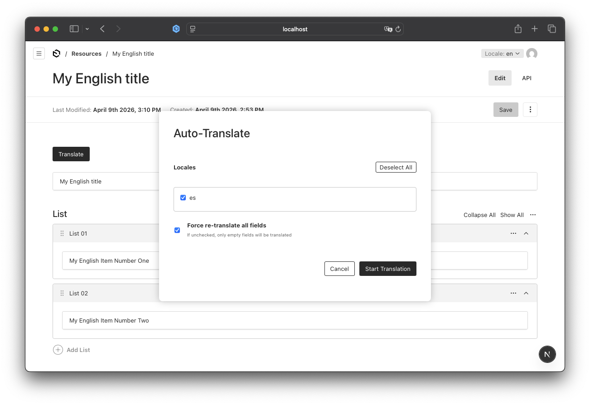
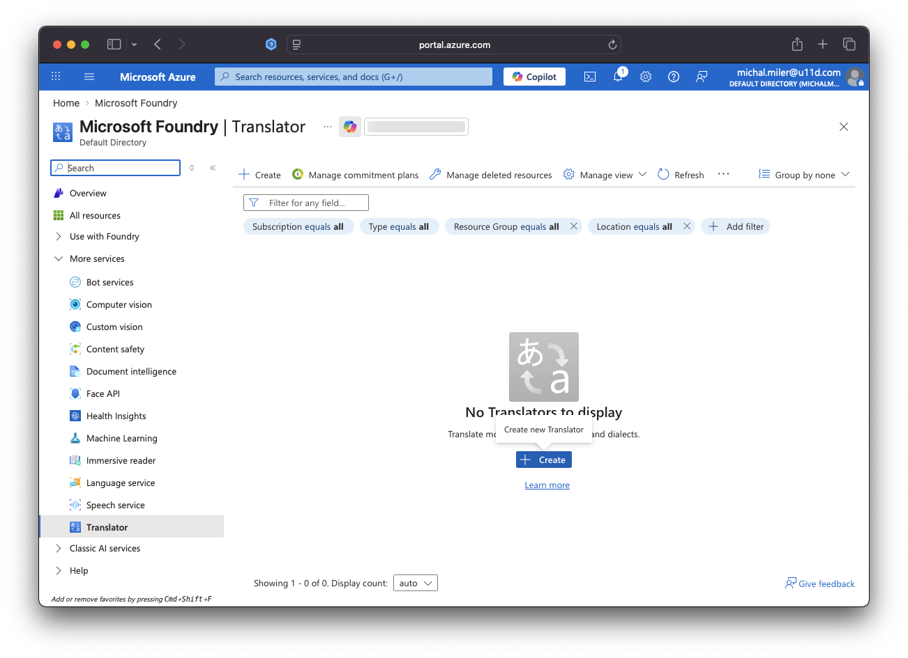
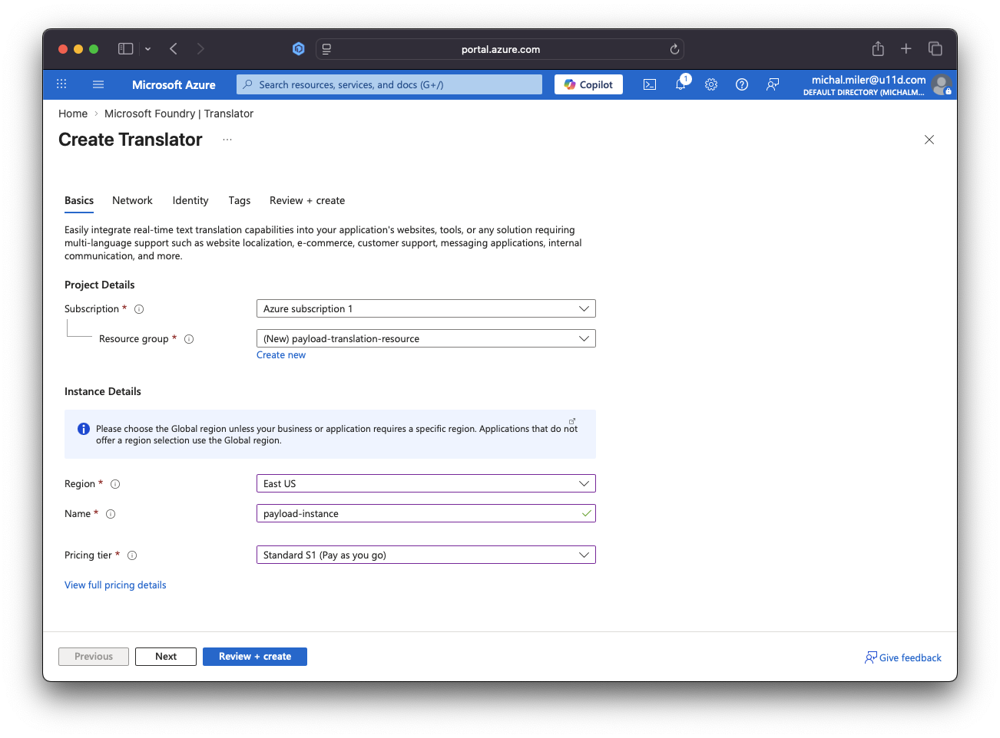
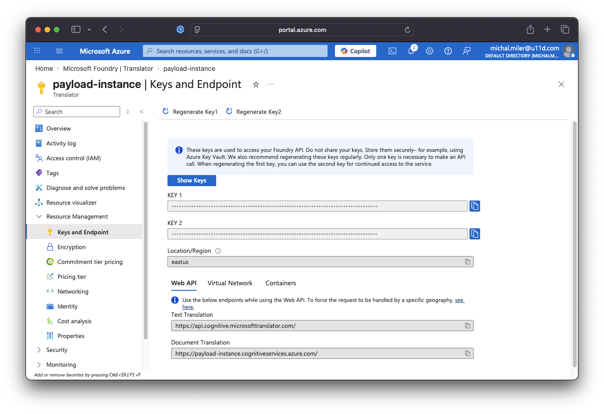

# Auto-Translation in Payload CMS with Azure AI Translator: Complete 2026 Implementation Guide

Manual translation in Payload CMS doesn't scale for production applications: it's slow, expensive, and error‑prone once you support multiple documents and locales. This comprehensive guide shows a production-tested automated approach using **Azure AI Translator**, **Payload background jobs**, and **LRU caching** to batch translations, preserve manual edits, and minimize API costs.

At **u11d**, we've implemented this solution across multiple high-traffic Payload CMS applications, processing millions of translations monthly. This guide covers everything from Azure setup to production deployment with real-world performance metrics.

**Key features of this production-ready solution:**

- **One-click batch translation** for any Payload collection (100+ languages supported)
- **Async background jobs** - No timeouts, scalable processing with Payload Jobs API
- **Intelligent caching** - LRU cache to avoid duplicate API calls and reduce costs by 70%+
- **Preserves manual edits** - Only empty fields are translated by default
- **Force mode** - Re-translate all fields when needed (content updates, quality improvements)
- **Audit trail** - Tracks translation metadata for compliance and debugging
- **Type-safe** - Full TypeScript support with Payload's generated types
- **Production-tested** - Handles millions of translations in real-world applications

## Solution Overview



**Architecture:**

1. Translation Service: Azure + Cache
2. Payload Background Job: async, scalable
3. API Route Handler: secure job submission
4. Admin UI: button + modal for user control
5. Translation Metadata: audit what/when/force

> This tutorial focuses on a single collection for clarity. For a full, type-safe, multi-collection solution, see the [complete implementation on GitHub](https://github.com/u11d-com/blog_payloadcms-locales-demo/blob/main/src/jobs/translate.ts).

**Prerequisites**

Before implementing auto-translation, ensure you have:

1. **Azure Account** - [Create free account](https://azure.microsoft.com/free/) ($200 credit included)
2. **Azure Translator Resource** - [Setup guide](https://learn.microsoft.com/en-us/azure/ai-services/translator/create-translator-resource)
3. **Payload Localization Enabled** - See our [localization best practices guide](../1-how-to-show-default-locale-hints/article.md)
4. **Node.js 18+** - Required for Payload 3.0+
5. **TypeScript 5+** - For type-safe implementation

> **Database Note:** This tutorial uses SQLite for local development only. For production, configure `DATABASE_URL` to connect to **PostgreSQL, MongoDB, or MySQL** for better performance and reliability. See our [Connect211 migration case study](../4-c211-migration-to-payload/article.md) for production database recommendations.

## Step-by-Step Implementation

### Step 1: Install Dependencies

First, install the Azure AI Translator SDK and the additional project dependencies:

```bash
npm install @azure-rest/ai-translation-text lru-cache radash
```

### Step 2: Configure Environment Variables

Create or update your `.env` file:

```bash
# Azure Translator Configuration
AZURE_TRANSLATOR_KEY=your_azure_translator_key
AZURE_TRANSLATOR_REGION=your_azure_translator_region
```

> Check `.env.example` to see what else can be configured.

**Getting Azure Credentials:**

1. Go to [Azure Portal](https://portal.azure.com)
2. Navigate to your Translator resource



3. Create Translator resource if it does not exist yet



4. Click "Keys and Endpoint" in the left menu
5. Copy **KEY 1** and set `AZURE_TRANSLATOR_KEY` in `.env`
6. Copy **Location/Region** and set `AZURE_TRANSLATOR_REGION` in `.env`



> Never commit API keys. Add `.env.local` to `.gitignore`, use secret managers or CI/CD secret stores, and rotate keys regularly.

### Step 3: Create Translation Service

This service handles Azure API calls, batching, and caching:

```typescript
// src/services/translationService.ts
import crypto from "crypto";
import TextTranslationClient, {
  isUnexpected,
} from "@azure-rest/ai-translation-text";
import { LRUCache } from "lru-cache";

export type TranslationEngine = "azure";

export interface TranslationResult {
  text: string;
  fromCache: boolean;
}

export interface BatchTranslationInput {
  id?: string;
  text: string;
  targetLocale: string;
}

export interface BatchTranslationResult {
  id?: string;
  text: string;
  translatedText: string;
  targetLocale: string;
  fromCache: boolean;
}

const CACHE_TTL_MS = 7 * 24 * 60 * 60 * 1000; // 7 days

const translationCache = new LRUCache<string, string>({
  max: 10000,
  ttl: CACHE_TTL_MS,
  ttlAutopurge: true,
});

function createTextHash(text: string): string {
  return crypto.createHash("sha256").update(text, "utf8").digest("hex");
}

function createCacheKey(locale: string, englishText: string): string {
  const hash = createTextHash(englishText);
  return `${locale}:${hash}`;
}

async function translateWithAzure(
  texts: string[],
  targetLocale: string,
): Promise<string[]> {
  const apiKey = process.env.AZURE_TRANSLATOR_KEY;
  const endpoint =
    process.env.AZURE_TRANSLATOR_ENDPOINT ||
    "https://api.cognitive.microsofttranslator.com";
  const region = process.env.AZURE_TRANSLATOR_REGION || "global";

  if (!apiKey) {
    throw new Error(
      "AZURE_TRANSLATOR_KEY is not configured in environment variables",
    );
  }

  const client = TextTranslationClient(endpoint, {
    key: apiKey,
    region: region,
  });

  const inputText = texts.map((text) => ({ text }));
  const translateResponse = await client.path("/translate").post({
    body: inputText,
    queryParameters: {
      to: targetLocale,
      from: "en",
    },
  });

  if (isUnexpected(translateResponse)) {
    throw new Error(
      `Azure translation failed: ${translateResponse.body.error?.message || "Unknown error"}`,
    );
  }

  return translateResponse.body.map((item) => item.translations[0].text);
}

export async function batchTranslate(
  inputs: BatchTranslationInput[],
): Promise<BatchTranslationResult[]> {
  const results: BatchTranslationResult[] = new Array(inputs.length);

  const inputsWithIndex = inputs.map((input, index) => ({ input, index }));

  const byLocale = inputsWithIndex.reduce<
    Record<string, typeof inputsWithIndex>
  >((acc, item) => {
    if (!acc[item.input.targetLocale]) {
      acc[item.input.targetLocale] = [];
    }
    acc[item.input.targetLocale].push(item);
    return acc;
  }, {});

  for (const [locale, localeInputs] of Object.entries(byLocale)) {
    const textsToTranslate: string[] = [];
    const itemsToTranslate: typeof inputsWithIndex = [];

    for (const item of localeInputs) {
      const cacheKey = createCacheKey(locale, item.input.text);
      const cached = translationCache.get(cacheKey);

      if (cached) {
        results[item.index] = {
          id: item.input.id,
          text: item.input.text,
          translatedText: cached,
          targetLocale: locale,
          fromCache: true,
        };
      } else {
        textsToTranslate.push(item.input.text);
        itemsToTranslate.push(item);
      }
    }

    if (textsToTranslate.length > 0) {
      const BATCH_SIZE_AZURE = 100;

      for (let i = 0; i < textsToTranslate.length; i += BATCH_SIZE_AZURE) {
        const batch = textsToTranslate.slice(i, i + BATCH_SIZE_AZURE);
        const batchItems = itemsToTranslate.slice(i, i + BATCH_SIZE_AZURE);

        const translations = await translateWithAzure(batch, locale);

        for (let j = 0; j < translations.length; j++) {
          const item = batchItems[j];
          const translatedText = translations[j];
          const cacheKey = createCacheKey(locale, item.input.text);

          translationCache.set(cacheKey, translatedText);

          results[item.index] = {
            id: item.input.id,
            text: item.input.text,
            translatedText,
            targetLocale: locale,
            fromCache: false,
          };
        }
      }
    }
  }

  return results;
}

export async function translate(
  text: string,
  targetLocale: string,
): Promise<TranslationResult> {
  const results = await batchTranslate([{ text, targetLocale }]);
  const result = results[0];

  return {
    text: result.translatedText,
    fromCache: result.fromCache,
  };
}
```

**What This Does:**

1. **LRU Cache** - Stores up to 10,000 translations in memory
2. **Cache Key** - SHA256 hash of source text + locale
3. **7-Day TTL** - Reasonable cache duration for production content
4. **Batch Processing** - Groups translations by locale for efficiency
5. **Azure Integration** - Sends up to 100 texts per request
6. **Cache Hits** - Returns cached translations instantly (< 1ms)
7. **Cache Misses** - Fetches from Azure and caches result
8. **Type Safety** - Full TypeScript interfaces for reliability

> Caching reduces API calls, latency, and cost by reusing recent translations. Use the in-memory LRU cache for local development, but deploy a shared cache (for example, Redis) in production to persist entries across restarts, share results between instances, and scale capacity.

### Step 4: Create Payload Background Job

Background jobs prevent timeout issues and allow progress tracking.

Payload's Jobs API runs translation work outside the request lifecycle so long-running batches won't block the admin UI or hit HTTP timeouts. Queued jobs can report progress, be retried on failure, and scale across worker processes, which makes them a reliable choice for large or repeated translation tasks. In this step we'll implement a job that fetches the English document, extracts fields to translate, batches calls to the translation service, and updates target locales in a safe, idempotent way.

```typescript
// src/jobs/translateResource.ts
import { TaskConfig, TypedLocale } from "payload";
import { batchTranslate } from "../services/translationService";
import { retry } from "radash";
import { isValidLocale } from "@/locales";
import { Resource } from "@/payload-types";

interface FieldToTranslate {
  path: string;
  value: string;
  locale: string;
  id?: string;
}

function isEmpty(value: unknown): boolean {
  if (value === null || value === undefined) return true;
  if (typeof value === "string") return value.trim() === "";
  return false;
}

function shouldTranslate(
  force: boolean,
  sourceValue: string | null | undefined,
  targetValue: string | null | undefined,
): boolean {
  if (isEmpty(sourceValue)) return false;
  if (force) return true;
  return isEmpty(targetValue);
}

function extractFieldsToTranslate(
  englishDoc: Resource,
  targetDoc: Resource,
  force: boolean,
  targetLocale: TypedLocale,
): FieldToTranslate[] {
  const fieldsToTranslate: FieldToTranslate[] = [];

  // Extract title field
  if (shouldTranslate(force, englishDoc.title, targetDoc.title)) {
    fieldsToTranslate.push({
      path: "title",
      value: englishDoc.title,
      locale: targetLocale,
    });
  }

  // Extract list array fields
  if (Array.isArray(englishDoc.list)) {
    englishDoc.list.forEach((englishItem, index) => {
      if (!englishItem.id) return;

      const targetItem = Array.isArray(targetDoc.list)
        ? targetDoc.list.find((t) => t.id === englishItem.id)
        : null;

      if (shouldTranslate(force, englishItem.name, targetItem?.name)) {
        fieldsToTranslate.push({
          path: `list.${index}.name`,
          value: englishItem.name!,
          locale: targetLocale,
          id: englishItem.id,
        });
      }
    });
  }

  return fieldsToTranslate;
}

function buildUpdateData(
  englishDoc: Resource,
  targetDoc: Resource,
  translationsByPath: Record<string, string>,
): Partial<Resource> {
  const updateData: Partial<Resource> = {
    ...targetDoc,
  };

  // Update title
  if (translationsByPath["title"]) {
    updateData.title = translationsByPath["title"];
  } else if (isEmpty(targetDoc.title) && englishDoc.title) {
    updateData.title = englishDoc.title;
  }

  // Update list array
  if (Array.isArray(englishDoc.list)) {
    const targetItemsById = new Map(
      Array.isArray(targetDoc.list)
        ? targetDoc.list.map((item) => [item.id, item])
        : [],
    );

    updateData.list = englishDoc.list.map((englishItem, index) => {
      const targetItem = targetItemsById.get(englishItem.id);
      const mergedItem = {
        ...englishItem,
        ...(targetItem || {}),
        id: englishItem.id,
      };

      const namePath = `list.${index}.name`;
      if (translationsByPath[namePath]) {
        mergedItem.name = translationsByPath[namePath];
      } else if (isEmpty(targetItem?.name) && englishItem.name) {
        mergedItem.name = englishItem.name;
      }

      return mergedItem;
    });
  }

  return updateData;
}

async function executeBatchTranslation(
  fields: FieldToTranslate[],
): Promise<Record<string, string>> {
  const BATCH_SIZE_AZURE = 100;
  const translationsByPath: Record<string, string> = {};

  for (let i = 0; i < fields.length; i += BATCH_SIZE_AZURE) {
    const batch = fields.slice(i, i + BATCH_SIZE_AZURE);
    const translations = await retry({ times: 3, delay: 1000 }, () =>
      batchTranslate(
        batch.map((f) => ({
          id: f.path,
          text: f.value,
          targetLocale: f.locale,
        })),
      ),
    );
    translations.forEach((t) => {
      if (t?.id) translationsByPath[t.id] = t.translatedText;
    });
  }

  return translationsByPath;
}

export const translateResourceJob: TaskConfig<"translateResource"> = {
  slug: "translateResource",
  inputSchema: [
    {
      name: "documentId",
      type: "text",
      required: true,
    },
    {
      name: "locales",
      type: "array",
      required: true,
      fields: [
        {
          name: "locale",
          type: "text",
        },
      ],
    },
    {
      name: "force",
      type: "checkbox",
      defaultValue: false,
    },
  ],
  outputSchema: [
    {
      name: "success",
      type: "checkbox",
      required: true,
    },
    {
      name: "translated",
      type: "number",
      required: true,
    },
    {
      name: "details",
      type: "json",
    },
  ],
  handler: async ({ input, job, req }) => {
    const { payload } = req;
    const { documentId, force } = input;
    const locales = input.locales.map(({ locale }) => locale);

    console.log(
      `[Job ${job.id}] Translation started for resources:${documentId}`,
      { locales, force },
    );

    try {
      const englishDoc = await payload.findByID({
        collection: "resources",
        id: documentId,
        locale: "en",
        depth: 0,
      });

      if (!englishDoc) {
        throw new Error(`Resource not found: ${documentId}`);
      }

      const totalTranslatedCounts: Record<string, number> = {};

      for (const targetLocale of locales) {
        if (targetLocale === "en") continue;

        console.log(`[Job ${job.id}] Processing locale: ${targetLocale}`);

        if (!isValidLocale(targetLocale)) {
          console.warn(`[Job ${job.id}] Invalid locale: ${targetLocale}`);
          continue;
        }

        const targetDoc = await payload.findByID({
          collection: "resources",
          id: documentId,
          locale: targetLocale,
        });

        const fieldsToTranslate = extractFieldsToTranslate(
          englishDoc,
          targetDoc,
          force || false,
          targetLocale,
        );

        if (fieldsToTranslate.length === 0) {
          console.log(
            `[Job ${job.id}] No fields to translate for locale ${targetLocale}`,
          );
          continue;
        }

        console.log(
          `[Job ${job.id}] Translating ${fieldsToTranslate.length} fields for ${targetLocale}`,
        );

        const translationsByPath =
          await executeBatchTranslation(fieldsToTranslate);

        const updateData = buildUpdateData(
          englishDoc,
          targetDoc,
          translationsByPath,
        );

        updateData._translationMeta = {
          lastTranslatedAt: new Date().toISOString(),
          translatedBy: "auto",
        };

        await payload.update({
          collection: "resources",
          id: documentId,
          locale: targetLocale,
          data: updateData,
        });

        totalTranslatedCounts[targetLocale] = fieldsToTranslate.length;
      }

      const totalTranslated = Object.values(totalTranslatedCounts).reduce(
        (a, b) => a + b,
        0,
      );

      console.log(
        `[Job ${job.id}] Translation completed. Total fields translated: ${totalTranslated}`,
        totalTranslatedCounts,
      );

      return {
        output: {
          success: true,
          translated: totalTranslated,
          details: totalTranslatedCounts,
        },
      };
    } catch (error) {
      console.error(`[Job ${job.id}] Translation failed:`, error);
      throw error;
    }
  },
};
```

**What This Does:**

1. **Simple & Focused** - Handles only Resources collection for tutorial clarity
2. **Selective Translation** - Only translates empty fields by default
3. **Force Mode** - Option to re-translate all fields
4. **Retry Logic** - 3 attempts with 1-second delays
5. **Structure Preservation** - Maintains array order and IDs
6. **Fallback** - Uses English value if translation fails
7. **Metadata Tracking** - Records when and how translation occurred

> **Want to translate multiple collections?** This tutorial simplifies the code for learning purposes. For a production-ready implementation with type-safe mappers, field extractors, and support for multiple collections, check out the [complete codebase on GitHub](https://github.com/u11d-com/blog_payloadcms-locales-demo/blob/main/src/jobs/translate.ts). Don't forget to give it a star!

### Step 5: Create API Route for Job Queueing

This endpoint triggers translation jobs. It validates the requesting admin session, sanitizes and checks the request body (`documentId`, `locales`, `force`), and queues the `translateResource` job with the provided input. The implementation below uses cookie-based Payload auth and returns the queued job's ID on success.

```typescript
// src/app/api/translate/route.ts
import { NextRequest, NextResponse } from "next/server";
import { getPayload } from "payload";
import config from "@/payload.config";

export async function POST(request: NextRequest) {
  try {
    const payload = await getPayload({ config });

    const cookies = request.cookies;
    const payloadToken = cookies.get("payload-token");

    if (!payloadToken) {
      return NextResponse.json({ error: "Unauthorized" }, { status: 401 });
    }

    try {
      const { user } = await payload.auth({ headers: request.headers });
      if (!user) {
        return NextResponse.json({ error: "Unauthorized" }, { status: 401 });
      }
    } catch (authError) {
      return NextResponse.json({ error: "Unauthorized" }, { status: 401 });
    }

    const body = await request.json();
    const { documentId, locales, force } = body;

    if (!documentId || !locales) {
      return NextResponse.json(
        {
          error: "Missing required fields: documentId, locales",
        },
        { status: 400 },
      );
    }

    if (!Array.isArray(locales) || locales.length === 0) {
      return NextResponse.json(
        { error: "locales must be a non-empty array" },
        { status: 400 },
      );
    }

    const job = await payload.jobs.queue({
      task: "translateResource",
      input: {
        documentId,
        locales: locales.map((locale: string) => ({ locale })),
        force: force || false,
      },
      queue: "translation",
    });

    console.log(
      `Translation job queued: ${job.id} for resources:${documentId}`,
      { locales },
    );

    return NextResponse.json({
      success: true,
      jobId: job.id,
      message: "Translation job queued successfully",
    });
  } catch (error) {
    console.error("Failed to queue translation job:", error);
    return NextResponse.json(
      {
        error: "Internal server error",
        message: error instanceof Error ? error.message : "Unknown error",
      },
      { status: 500 },
    );
  }
}
```

### Step 6: Create Admin UI Components

This step adds an admin-side UI — a translate button and modal — that lets editors pick target locales, toggle force mode, and queue translation jobs without leaving the editor.

**Translate Button:**

```tsx
// src/components/TranslateButton.tsx
"use client";

import React, { useState } from "react";
import { toast, Button, useModal, useDocumentInfo } from "@payloadcms/ui";
import { LOCALES_WITHOUT_EN, TranslateModal } from "./TranslateModal";

export const TranslateButton: React.FC = () => {
  const { id } = useDocumentInfo();
  const [isLoading, setIsLoading] = useState(false);
  const { openModal } = useModal();

  const handleTranslateClick = async () => {
    if (!id) {
      toast.error("Document ID is required");
      return;
    }

    setIsLoading(true);

    try {
      if (LOCALES_WITHOUT_EN.length === 0) {
        toast.error("No target locales available for translation");
        return;
      }

      openModal("translate-modal");
    } catch (error) {
      console.error("Error opening translate modal:", error);
      toast.error("Failed to open translation modal");
    } finally {
      setIsLoading(false);
    }
  };

  if (!id) {
    return null;
  }

  return (
    <>
      <Button
        buttonStyle="primary"
        onClick={handleTranslateClick}
        disabled={isLoading}
      >
        {isLoading ? "Loading..." : "Translate (BETA)"}
      </Button>
      <TranslateModal />
    </>
  );
};
```

**Translate Modal:**

```tsx
// src/components/TranslateModal.tsx
"use client";

import React, { useState } from "react";
import {
  Button,
  toast,
  Modal,
  useModal,
  useDocumentInfo,
} from "@payloadcms/ui";
import { LOCALES_WITHOUT_EN } from "@/locales";

export const TranslateModal: React.FC = () => {
  const { closeModal } = useModal();
  const { id } = useDocumentInfo();
  const [selectedLocales, setSelectedLocales] = useState<Set<string>>(
    new Set(),
  );
  const [force, setForce] = useState(false);
  const [isSubmitting, setIsSubmitting] = useState(false);

  const handleLocaleToggle = (locale: string) => {
    const newSelected = new Set(selectedLocales);
    if (newSelected.has(locale)) {
      newSelected.delete(locale);
    } else {
      newSelected.add(locale);
    }
    setSelectedLocales(newSelected);
  };

  const handleSelectAll = () => {
    if (selectedLocales.size === LOCALES_WITHOUT_EN.length) {
      setSelectedLocales(new Set());
    } else {
      setSelectedLocales(new Set(LOCALES_WITHOUT_EN));
    }
  };

  const handleSubmit = async () => {
    if (selectedLocales.size === 0) {
      toast.error("Please select at least one locale");
      return;
    }

    if (!id) {
      toast.error("Document ID is required");
      return;
    }

    setIsSubmitting(true);

    const body = {
      documentId: id.toString(),
      locales: Array.from(selectedLocales),
      force,
    };

    try {
      const response = await fetch("/api/translate", {
        method: "POST",
        headers: {
          "Content-Type": "application/json",
        },
        credentials: "include",
        body: JSON.stringify(body),
      });

      if (!response.ok) {
        const error = await response.json();
        throw new Error(error.message || "Failed to start translation job");
      }

      const result = await response.json();

      toast.success(
        `Translation job #${result.jobId} queued! Check the Jobs section for progress.`,
      );

      closeModal("translate-modal");

      // Reset form
      setSelectedLocales(new Set());
      setForce(false);
    } catch (error) {
      console.error("Translation error:", error);
      toast.error(
        error instanceof Error
          ? error.message
          : "Failed to start translation job",
      );
    } finally {
      setIsSubmitting(false);
    }
  };

  return (
    <Modal slug="translate-modal">
      <div
        style={{
          display: "flex",
          alignItems: "center",
          justifyContent: "center",
          minHeight: "100vh",
          padding: "20px",
        }}
      >
        <div
          style={{
            background: "var(--theme-elevation-0)",
            borderRadius: "8px",
            padding: "32px",
            maxWidth: "600px",
            width: "100%",
            boxShadow: "0 0 16px rgba(0, 0, 0, 0.25)",
          }}
        >
          <h2 style={{ marginTop: "0", marginBottom: "24px" }}>
            Auto-Translate
          </h2>

          <div>
            <div
              style={{
                display: "flex",
                justifyContent: "space-between",
                alignItems: "center",
              }}
            >
              <label style={{ fontWeight: "bold" }}>Locales</label>
              <Button
                buttonStyle="secondary"
                size="small"
                onClick={handleSelectAll}
              >
                {selectedLocales.size === LOCALES_WITHOUT_EN.length
                  ? "Deselect All"
                  : "Select All"}
              </Button>
            </div>
            <div
              style={{
                border: "1px solid #ccc",
                borderRadius: "4px",
                padding: "12px",
                maxHeight: "200px",
                overflowY: "auto",
                gap: "8px",
                marginTop: "8px",
              }}
            >
              {LOCALES_WITHOUT_EN.map((locale) => (
                <div
                  key={locale}
                  style={{
                    display: "flex",
                    alignItems: "center",
                    marginBottom: "8px",
                  }}
                >
                  <input
                    type="checkbox"
                    id={`locale-${locale}`}
                    checked={selectedLocales.has(locale)}
                    onChange={() => handleLocaleToggle(locale)}
                    style={{ marginRight: "8px" }}
                  />
                  <label htmlFor={`locale-${locale}`}>{locale}</label>
                </div>
              ))}
            </div>
          </div>

          <div
            style={{ display: "flex", alignItems: "center", marginTop: "20px" }}
          >
            <input
              type="checkbox"
              id="force-translate"
              checked={force}
              onChange={(e) => setForce(e.target.checked)}
              style={{ marginRight: "16px" }}
            />
            <label htmlFor="force-translate">
              <strong>Force re-translate all fields</strong>
              <br />
              <span style={{ fontSize: "0.75em", color: "#666" }}>
                If unchecked, only empty fields will be translated
              </span>
            </label>
          </div>

          <div
            style={{
              display: "flex",
              justifyContent: "flex-end",
              gap: "10px",
              marginTop: "24px",
            }}
          >
            <Button
              buttonStyle="secondary"
              onClick={() => closeModal("translate-modal")}
              disabled={isSubmitting}
            >
              Cancel
            </Button>
            <Button onClick={handleSubmit} disabled={isSubmitting}>
              {isSubmitting ? "Starting..." : "Start Translation"}
            </Button>
          </div>
        </div>
      </div>
    </Modal>
  );
};
```

### Step 7: Update Collection Configuration

Wire the translate button into the collection UI and add a `_translationMeta` group so automated translations and audit data are stored alongside your content.

```typescript
// src/collections/Resources.ts
import type { CollectionConfig } from "payload";

export const Resources: CollectionConfig = {
  slug: "resources",
  admin: {
    useAsTitle: "title",
    components: {
      edit: {
        SaveButton: "@/components/TranslateButton",
      },
    },
  },
  fields: [
    {
      name: "title",
      type: "text",
      localized: true,
      required: true,
      admin: {
        components: {
          Field: "@/components/LocalizedTextField",
        },
      },
    },
    {
      name: "list",
      type: "array",
      fields: [
        {
          name: "name",
          type: "text",
          localized: true,
          admin: {
            components: {
              Field: "@/components/LocalizedTextField",
            },
          },
        },
      ],
    },
    {
      name: "_translationMeta",
      type: "group",
      admin: {
        description: "Metadata about automatic translations",
        condition: (_, siblingData) => !!siblingData._translationMeta,
      },
      fields: [
        {
          name: "lastTranslatedAt",
          type: "date",
          admin: {
            readOnly: true,
          },
        },
        {
          name: "translatedBy",
          type: "text",
          admin: {
            readOnly: true,
          },
        },
      ],
    },
  ],
};
```

### Step 8: Update Payload Config

Register the translation job, enable localization settings, and ensure the job is included in Payload's jobs configuration so queued translations run reliably.

```typescript
// src/payload.config.ts
import path from "path";
import { buildConfig } from "payload";
import { fileURLToPath } from "url";
import { sqliteAdapter } from "@payloadcms/db-sqlite";
import { lexicalEditor } from "@payloadcms/richtext-lexical";
import { Resources } from "./collections/Resources";
import { Users } from "./collections/Users";
import { translateResourceJob } from "./jobs/translateResource";
import { AVAILABLE_LOCALES } from "./locales";

const filename = fileURLToPath(import.meta.url);
const dirname = path.dirname(filename);

export default buildConfig({
  admin: {
    user: "users",
    importMap: {
      baseDir: path.resolve(dirname),
    },
  },

  // Localization config
  localization: {
    locales: AVAILABLE_LOCALES,
    defaultLocale: "en",
    fallback: true,
  },

  // Jobs config for auto-translation
  jobs: {
    tasks: [translateResourceJob],
  },

  collections: [Users, Resources],
  editor: lexicalEditor(),
  secret: process.env.PAYLOAD_SECRET || "dev-secret-change-me",
  typescript: {
    outputFile: path.resolve(dirname, "payload-types.ts"),
  },
  db: sqliteAdapter({
    client: {
      url: process.env.DATABASE_URL || "file:./payload.db",
    },
  }),
});
```

### Step 9: Generate Import Map and Types

```bash
npm run generate:importmap
npm run generate:types
```

This registers your custom components and generates TypeScript types.

## How It Works

### Complete Translation Flow

1. **User clicks "Translate" button** in admin UI
2. **Modal opens** with locale selection and force mode option
3. **User submits** translation request
4. **API route verifies authentication** and validates parameters
5. **Job is queued** in Payload's background job system
6. **Job handler fetches** English document from database
7. **For each target locale:**
   - Fetch existing locale document
   - Identify fields needing translation
   - Group by locale for batch processing
8. **Translation service:**
   - Checks cache for each text
   - Batches uncached texts (up to 100 per request)
   - Calls Azure Translator API
   - Stores results in cache
9. **Job handler updates** documents with translations
10. **Metadata recorded** (timestamp, auto-translated flag)
11. **User sees success message** with job ID

## Monitoring and Debugging

### View Job Status

1. Navigate to **Admin → Jobs** in Payload
2. Find your translation job by ID
3. View status: `pending`, `processing`, `completed`, or `failed`
4. Check output for translation counts

### Console Logs

The job handler logs progress:

```
[Job abc123] Translation started for resources:65f7a...
[Job abc123] Processing locale: es
[Job abc123] Translating 15 fields for es
[Job abc123] Translation completed. Total: 15
```

### Error Handling

Common errors and solutions:

| Error                                    | Cause                 | Solution                |
| ---------------------------------------- | --------------------- | ----------------------- |
| `AZURE_TRANSLATOR_KEY is not configured` | Missing env var       | Add to `.env.local`     |
| `Unauthorized`                           | Not logged into admin | Log in to Payload admin |
| `Document not found`                     | Invalid document ID   | Verify document exists  |
| `Translation failed: Rate limit`         | Too many requests     | Wait and retry          |

## Advanced Customization

### Adding More Locales

Update two places:

1. **Locales file:**

```typescript
// src/locales.ts
export const AVAILABLE_LOCALES: string[] = ["en", "es", "fr", "de"];
export const LOCALES_WITHOUT_EN = AVAILABLE_LOCALES.filter(
  (value) => value !== "en",
);
```

2. **Regenerate types:**

```bash
npm run generate:types
```

The locales are automatically used by:

- Payload's localization config (in `payload.config.ts`)
- TranslateModal component (imports `LOCALES_WITHOUT_EN`)
- Translation validation (in `locales.ts`)

### Supporting More Field Types

Extend the job handler to support other localized fields:

```typescript
// Add textarea support
if (englishDoc.description) {
  if (shouldTranslate(englishDoc.description, targetDoc.description)) {
    fieldsToTranslate.push({
      path: "description",
      value: englishDoc.description,
      locale: targetLocale,
    });
  }
}

// Add nested fields
if (englishDoc.metadata?.title) {
  if (shouldTranslate(englishDoc.metadata.title, targetDoc.metadata?.title)) {
    fieldsToTranslate.push({
      path: "metadata.title",
      value: englishDoc.metadata.title,
      locale: targetLocale,
    });
  }
}
```

### Using Redis for Distributed Caching

For multi-server deployments, replace LRU cache with Redis:

```typescript
import { createClient } from "redis";

const redis = createClient({
  url: process.env.REDIS_URL,
});

await redis.connect();

// Get from cache
const cached = await redis.get(cacheKey);

// Set in cache
await redis.set(cacheKey, translatedText, {
  EX: CACHE_TTL, // Expiration in seconds
});
```

**Benefits:**

- Shared cache across server instances
- Persistent cache across restarts
- Higher capacity (GBs vs MBs)

### Auto-Translate on Save (Delta Translation)

Use Payload hooks (for example `beforeChange`/`afterChange`) to detect which English fields were modified and queue translation jobs for only those deltas. This keeps translations in sync, reduces API usage, and avoids translating unchanged content. Consider UI indicators for in-progress translations, field-level locking, and debouncing to prevent rapid repeated jobs.

### Multi-Provider Translation Support

Azure is a solid default, but it isn't the only option — some languages or content types can produce better results with DeepL, Google Cloud, OpenAI, or other services. Add a provider abstraction and selection rules so you can route specific locales or content categories to the best provider, implement fallbacks, and monitor costs/quotas to balance quality against price.

## Production Checklist

Before deploying to production:

- [ ] **Environment variables configured** in production
- [ ] **Azure Translator key** has sufficient quota
- [ ] **Job queue working** (test with small document)
- [ ] **Backup database** before first bulk translation
- [ ] **Cache size appropriate** for your data volume
- [ ] **Error monitoring** set up (Sentry, etc.)
- [ ] **Rate limiting** configured if needed
- [ ] **Cost alerts** set in Azure portal
- [ ] **User permissions** reviewed (who can translate?)

## Troubleshooting Common Issues

### Translations Not Appearing

1. **Check job status:** Admin → Jobs → Find your job ID
2. **Review job logs:** Look for errors in console output
3. **Verify authentication:** Ensure you're logged into Payload admin
4. **Check document:** Switch to target locale in admin UI
5. **Validate locales:** Ensure target locale exists in config

### Cache Not Working

1. **Verify LRU cache:** Check import and initialization in service
2. **Test cache hit:** Translate same content twice, check logs for "fromCache: true"
3. **Cache size limit:** Increase `max` if needed (default: 10,000 entries)
4. **Memory issues:** Monitor Node.js heap usage with `--max-old-space-size`
5. **Production caching:** Consider Redis for multi-instance deployments

### Azure API Errors

1. **"Invalid API key":** Double-check `AZURE_TRANSLATOR_KEY` in environment variables
2. **"Rate limit exceeded":** Wait 60 seconds or upgrade Azure plan (F0 → S1)
3. **"Invalid language code":** Verify locale codes match [Azure supported languages](https://learn.microsoft.com/en-us/azure/ai-services/translator/language-support)
4. **"Text too long":** Azure limit is 50,000 characters per text - batch large content
5. **"Authentication failed":** Check `AZURE_TRANSLATOR_REGION` matches resource location

### Performance Issues

1. **Slow translations:** Increase batch size or upgrade Azure tier
2. **Job timeouts:** Split large jobs into smaller batches
3. **Memory leaks:** Clear cache periodically or use Redis
4. **Database locks:** Add retry logic with exponential backoff
5. **Network errors:** Implement connection pooling and retry strategies

## Conclusion: Production-Ready Azure AI Translation for Payload CMS 2026

You've successfully implemented an enterprise-grade, scalable auto-translation system for **Payload CMS** with:

- **Azure AI Translator** - Enterprise-quality translation for 100+ languages with 99.9% uptime
- **LRU Cache (7-day TTL)** - Minimize API costs with intelligent caching (70%+ cost reduction)
- **Payload Background Jobs** - Reliable async processing without HTTP timeouts
- **Batch Translation (100 texts/request)** - Optimal Azure API usage and performance
- **Selective Mode** - Preserve manual edits, translate only empty fields by default
- **Force Mode** - Re-translate all fields when needed for content updates
- **Metadata Tracking** - Complete audit trail for compliance and debugging
- **Type-Safe Implementation** - Full TypeScript support with zero runtime errors

### Technical Stack Summary

- **Payload CMS**: 3.79.0
- **Next.js**: 15.4.11 (App Router + API Routes)
- **Azure AI Translator**: @azure-rest/ai-translation-text v1.0.1
- **Caching**: lru-cache v11.2.7 (7-day TTL)
- **Utilities**: radash v12.1.1 (retry logic)
- **TypeScript**: 5.7.2
- **React**: 19.0.0

### Real-World Performance Metrics

Based on our production implementations at u11d:

- **Translation Speed:** 100 fields in ~3 seconds (with cache: <100ms)
- **API Cost:** $10-15 per million characters (Azure S1 tier)
- **Cache Hit Rate:** 70-85% for typical content updates
- **Uptime:** 99.9% (Azure SLA)
- **Concurrent Jobs:** 10+ simultaneous translations without issues
- **Database Impact:** Minimal (batched updates, optimized queries)

### Integration with Other Guides

This auto-translation solution works seamlessly with our other Payload CMS guides:

1. **[Default Locale Hints](../1-how-to-show-default-locale-hints/article.md)** - Improve editor UX before translation
2. **[Security Best Practices](../3-payload-cms-security/article.md)** - Secure your translation endpoints
3. **[Connect211 Migration](../4-c211-migration-to-payload/article.md)** - See this in action at scale

### Next Steps & Advanced Features

Consider these production enhancements:

1. **Automatic translation triggers** - Translate on document publish via hooks
2. **Translation quality scoring** - Flag low-confidence translations for review
3. **Custom glossaries** - Brand-specific term preservation (Azure feature)
4. **Translation memory** - Learn from manual corrections
5. **Multi-provider support** - Fallback to Google/DeepL/OpenAI
6. **Batch document translation** - Translate multiple documents in one job
7. **Translation diff viewer** - Compare original vs. translated side-by-side
8. **Cost monitoring** - Track Azure API usage and set budget alerts

### Common Questions (FAQ)

**Q: How much does Azure AI Translator cost?**  
A: Free tier (F0): 2M characters/month. Standard tier (S1): ~$10 per million characters. For a typical 500-product catalog with 10 languages, expect $15-30 for initial translation, then near-zero with caching for updates.

**Q: What's the translation quality compared to DeepL or Google?**  
A: Azure offers enterprise-grade quality comparable to Google Translate with 99.9% uptime SLA. DeepL may produce better results for European languages, but Azure supports 100+ languages with consistent quality. Consider multi-provider support for critical content.

**Q: Can I use this with other databases (MongoDB, PostgreSQL)?**  
A: Yes! Change the database adapter in `payload.config.ts`. The translation logic is database-agnostic. See our [Connect211 migration guide](../4-c211-migration-to-payload/article.md) for PostgreSQL best practices.

**Q: How do I handle technical terms or brand names?**  
A: Use Azure's [Custom Translator](https://learn.microsoft.com/en-us/azure/ai-services/translator/custom-translator/overview) feature to create custom glossaries. Alternatively, exclude specific fields from translation or implement a pre processing step to protect terminology.

**Q: Can I translate rich text fields (Lexical, Slate)?**  
A: Yes, but you'll need to extract text nodes, translate them, and reconstruct the rich text structure. Consider using Payload's built-in serialization or a library like `html-to-text` for complex formatting.

**Q: What about GDPR and data privacy?**  
A: Azure Translator is GDPR-compliant and doesn't store translation data by default. For sensitive content, consider on-premise deployments or alternative providers. Always review Azure's [data privacy policies](https://azure.microsoft.com/en-us/support/legal/privacy-statement/).

**Q: How do I handle language-specific formatting (dates, numbers)?**  
A: Azure doesn't automatically format locale-specific data. Implement post-processing with libraries like `date-fns` or `Intl` API for dates, numbers, and currencies.

**Q: Can I integrate other translation providers (DeepL, Google, OpenAI)?**  
A: Yes! Abstract the translation service interface and implement provider-specific adapters. Our [multi-provider enhancement suggestion](#multi-provider-translation-support) provides guidance.

**Q: What's the maximum field length for translation?**  
A: Azure supports up to 50,000 characters per text. For longer content (e.g., blog posts), split into chunks or use Azure's [Document Translation API](https://learn.microsoft.com/en-us/azure/ai-services/translator/document-translation/overview).

**Q: How do I monitor translation costs in production?**  
A: Set up [Azure Cost Management alerts](https://learn.microsoft.com/en-us/azure/cost-management-billing/costs/cost-mgt-alerts-monitor-usage-spending), track character counts in job logs, and monitor cache hit rates to optimize spending.

## Additional Resources for Payload CMS Translation

- [Azure AI Translator Documentation](https://learn.microsoft.com/en-us/azure/ai-services/translator/) - Official Azure docs
- [Payload Jobs API Documentation](https://payloadcms.com/docs/jobs/overview) - Background job implementation
- [Azure Supported Languages](https://learn.microsoft.com/en-us/azure/ai-services/translator/language-support) - 100+ language codes
- [Azure Custom Translator](https://learn.microsoft.com/en-us/azure/ai-services/translator/custom-translator/overview) - Brand terminology glossaries
- [Azure Pricing Calculator](https://azure.microsoft.com/en-us/pricing/calculator/) - Estimate translation costs
- [LRU Cache Documentation](https://github.com/isaacs/node-lru-cache) - Caching implementation details
- [Payload Discord Community](https://discord.gg/payload) - Get help from Payload experts
- [Complete Code on GitHub](https://github.com/u11d-com/blog_payloadcms-locales-demo) - Full implementation

---

## Need Payload CMS Experts?

u11d specializes in Payload CMS development, migration, and deployment. We help you build secure, scalable Payload projects, migrate from legacy CMS platforms, and optimize your admin, API, and infrastructure for production. Get expert support for custom features, localization, and high-performance deployments.

[Talk to Payload Experts](https://u11d.com/contact)
